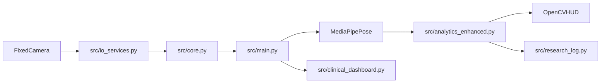

# Fixed-Phone Vision Posture Analytics

**Version:** 3.0 (Pure Vision, Fixed Camera)
**Scope:** Real-time MediaPipe pose tracking, scale-invariant posture analysis, 3D metric calculations. No audio, no networking, no LLMs.

## 1. Runtime Model

The application is a pure software computer-vision loop. OpenCV captures frames from a fixed camera, MediaPipe Pose extracts landmarks, and the mathematical pipeline computes posture strictly via scale-invariant World Landmark 3D geometry.

## 2. Repository layout

| Path | Responsibility |
| --- | --- |
| `src/` | Runtime modules (entry point `src/main.py`) |
| `tests/` | Camera-free unit tests |
| `docs/` | Operator guides (setup, configuration, exports) |
| `exports/` | Local CSV/JSON session output (not committed) |

## 3. Active Modules

| Module | Responsibility |
| --- | --- |
| `src/main.py` | Main display loop, MediaPipe pose processing, posture overlays |
| `src/io_services.py` | OpenCV asynchronous camera frame capture |
| `src/analytics_enhanced.py` | Slouch tracking, lean geometry, scale normalization |
| `src/core.py` | Thread-safe shared application state and locking |
| `src/config.py` | Constants, environment limits, camera configurations |
| `src/research_log.py` | Local CSV export of 3D metric datasets |
| `src/clinical_dashboard.py` | JSON dump of session posture compliance percentages |
| `src/analytics.py` | Unused gait analyser (not wired into the live loop) |

## 4. Data Flow

```text
[Fixed Camera] -> io_services.camera_thread -> global_state.latest_frame
global_state.latest_frame -> main.py -> MediaPipe Pose -> World Landmarks
World Landmarks -> analytics_enhanced.py -> Scale Normalized Geometry
Metrics -> HUD display & local disk logging
```


